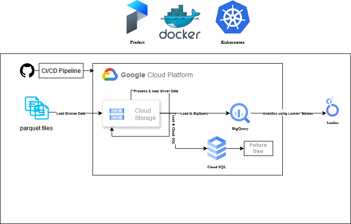

# Cloud-Native Data Processing and Visualization Pipeline

This project aims to build a robust, scalable, and efficient data processing and visualization pipeline leveraging modern cloud-native technologies. The system will process raw data (from Parquet files), transform it, store it in a centralized cloud storage and load it into data warehouse (Google Big Query) and do transformations using DBT (might not use it), and enable data visualization using Tableau or Looker.

## Workflow

### 1. Data Ingestion:
- Source: The pipeline accepts data batch-processed Parquet files.
- Ingestion Tools: Prefect orchestrates tasks for extracting, validating, and uploading data to Google Cloud Storage (GCS).

### 2. Data Storage and Transformation:
- Google Cloud Storage: Acts as an intermediate storage layer for raw or semi-processed data.
- Google Big Query: The data is loaded into Big Query, where it undergoes transformation using SQL-based processing for downstream analytics.
- Google Cloud SQL: The data is loaded into Cloud SQL as well, where it gets stored in a structured form for other future use cases.

### 3. Data Visualization:
- Tableau or Looker: The transformed data is visualized in Tableau/Looker, providing insights through dashboards and reports.

### 4. Infrastructure Management:
~~- Terraform: Provisions the Google Cloud resources, including GCS, Big Query, IAM roles, and networking configurations, ensuring reproducibility and compliance.~~

### 5. CI/CD Pipeline:
- Source control using GitHub repository
- Automated testing and deployment process
- Continuous integration and delivery for code changes
- Automated infrastructure updates through Terraform

## Technology Stack and Role of Each Component

### Docker:
Docker will be used to containerize application components, ensuring consistency across environments. For example:
- Prefect agents running data workflows.
- Data transformation scripts encapsulated within lightweight containers.

### Kubernetes (K8s):
Kubernetes will orchestrate and scale containerized applications, such as:
- Prefect agents for managing concurrent workflows.
- Kafka consumers or producers (if a Kafka-based stream is implemented).
K8s ensures high availability, automatic scaling, and resilience of the pipeline components.

### Prefect:
Orchestrates the data pipeline's workflows, managing task dependencies, scheduling, and monitoring.

### Google Cloud Storage (GCS):
Acts as the central storage for intermediate data (CSV uploads, transformed files).

### Google Big Query:
A fully managed data warehouse for analytics and processing, enabling SQL-based querying of large datasets.

### Google Cloud SQL:
A fully managed relational database service for MySQL, PostgreSQL, and SQL Server.

### Tableau/Looker:
Provides visualization layers for stakeholders to interact with the processed data via dashboards and reports.

 ### Terraform:
~~- Automates the provisioning of the infrastructure components (e.g., GCS buckets, Big Query datasets, Kubernetes clusters).~~

## Example Pipeline Steps
1. Data Ingestion: Prefect detects new data (from Parquet Files or GCS).
2. Intermediate Storage: Data is uploaded to a GCS bucket.
3. Processing: Prefect tasks process and load data into Big Query.
4. Visualization: Tableau or Looker connects to Big Query to visualize key metrics.

## Benefits
- Scalability: Kubernetes scales compute resources dynamically based on workload demands.
- Resilience: Kubernetes and Docker ensure the system is fault tolerant.
- Automation: Terraform automates infrastructure provisioning and management.
- Insightful Analytics: Tableau/Looker provides actionable insights.# Cloud-Native Data Processing and Visualization Pipeline

## Dataset
We have decided yet, but we can use any dataset to transform and visualize the data. (e.g. Weather data in multiple cities)

## Architecture Diagram

## ProjectMilestones

### Phase 1: Basic Setup (Erik Laki)
#### Infrastructure Setup
- [ ] Set up Google Cloud environment ✔
- [ ] Configure basic Kubernetes cluster✔
- [ ] Create GitHub repository✔
- [ ] Implement basic CI/CD pipeline✔
- [ ] Create and test first Docker container✔

#### Deliverables:
* Working Kubernetes cluster✔
* Basic CI/CD pipeline✔
* Initial Docker container✔

### Phase 2: Data Pipeline (Saddam Mughal)
#### Data Ingestion Setup
- [ ] Configure GCS bucket✔
- [ ] Implement Parquet file reading✔
- [ ] Create basic data transformations✔
- [ ] Set up BigQuery connection✔

#### Deliverables:
* Working data ingestion flow✔
* Basic data transformation pipeline✔
* Data storage structure✔

### Phase 3: Processing & Storage  (Muhammad Zeeshan Nazar)
#### Data Processing Implementation
- [ ] Implement core data transformations✔
- [ ] Configure Cloud SQL
- [ ] Create processing pipeline✔
- [ ] Test complete data flow✔

#### Deliverables:
* Functional transformation pipeline✔
* Working database structure
* Verified data processing✔

### Phase 4: Visualization & Completion (Dominik Zauner)
#### Final Implementation
- [ ] Set up Tableau/Looker connection
- [ ] Create main dashboard
- [ ] Complete documentation partially
- [ ] Final testing and presentation

#### Deliverables:
* Working dashboard
* Complete documentation
* Final presentation

## Technology Stack
* Google Cloud Platform
* Kubernetes
* Docker
* BigQuery
* Cloud SQL
* Tableau/Looker
* GitHub Actions (CI/CD)