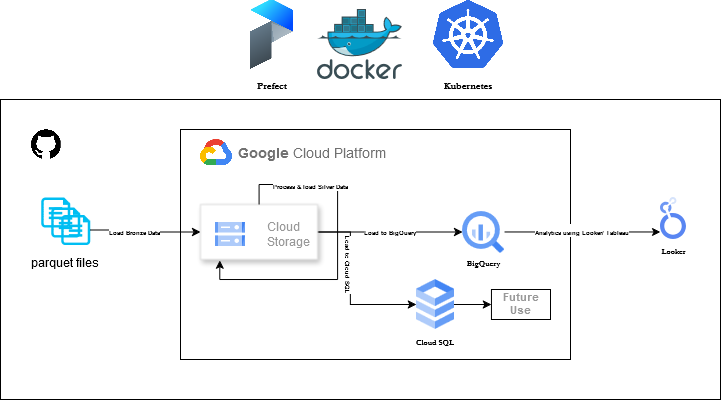

# Cloud-Native Data Processing and Visualization Pipeline

This project aims to build a robust, scalable, and efficient data processing and visualization pipeline leveraging modern cloud-native technologies. The system will process raw data (from Parquet files), transform it, store it in a centralized cloud storage and load it into data warehouse (Google Big Query) and do transformations using DBT (might not use it), and enable data visualization using Tableau or Looker. The infrastructure will be provisioned and managed using Terraform, ensuring consistent, repeatable deployments.

## Workflow

### 1. Data Ingestion:
- Source: The pipeline accepts data batch-processed Parquet files.
- Ingestion Tools: Prefect orchestrates tasks for extracting, validating, and uploading data to Google Cloud Storage (GCS).

### 2. Data Storage and Transformation:
- Google Cloud Storage: Acts as an intermediate storage layer for raw or semi-processed data.
- Google Big Query: The data is loaded into Big Query, where it undergoes transformation using SQL-based processing for downstream analytics.
- Google Cloud SQL: The data is loaded into Cloud SQL as well, where it gets stored in a structured form for other future use cases.

### 3. Data Visualization:
- Tableau or Looker: The transformed data is visualized in Tableau/Looker, providing insights through dashboards and reports.

### 4. Infrastructure Management:
~~- Terraform: Provisions the Google Cloud resources, including GCS, Big Query, IAM roles, and networking configurations, ensuring reproducibility and compliance.~~

### 5. CI/CD Pipeline:
- Source control using GitHub repository
- Automated testing and deployment process
- Continuous integration and delivery for code changes
- Automated infrastructure updates through Terraform

## Technology Stack and Role of Each Component

### Docker:
Docker will be used to containerize application components, ensuring consistency across environments. For example:
- Prefect agents running data workflows.
- Data transformation scripts encapsulated within lightweight containers.

### Kubernetes (K8s):
Kubernetes will orchestrate and scale containerized applications, such as:
- Prefect agents for managing concurrent workflows.
- Kafka consumers or producers (if a Kafka-based stream is implemented).
K8s ensures high availability, automatic scaling, and resilience of the pipeline components.

### Prefect:
Orchestrates the data pipeline's workflows, managing task dependencies, scheduling, and monitoring.

### Google Cloud Storage (GCS):
Acts as the central storage for intermediate data (CSV uploads, transformed files).

### Google Big Query:
A fully managed data warehouse for analytics and processing, enabling SQL-based querying of large datasets.

### Google Cloud SQL:
A fully managed relational database service for MySQL, PostgreSQL, and SQL Server.

### Tableau/Looker:
Provides visualization layers for stakeholders to interact with the processed data via dashboards and reports.

~~- ### Terraform: ~~
~~- Automates the provisioning of the infrastructure components (e.g., GCS buckets, Big Query datasets, Kubernetes clusters).~~

## Example Pipeline Steps
1. Data Ingestion: Prefect detects new data (from Parquet Files or GCS).
2. Intermediate Storage: Data is uploaded to a GCS bucket.
3. Processing: Prefect tasks process and load data into Big Query.
4. Visualization: Tableau or Looker connects to Big Query to visualize key metrics.

## Benefits
- Scalability: Kubernetes scales compute resources dynamically based on workload demands.
- Resilience: Kubernetes and Docker ensure the system is fault tolerant.
- Automation: Terraform automates infrastructure provisioning and management.
- Insightful Analytics: Tableau/Looker provides actionable insights.# Cloud-Native Data Processing and Visualization Pipeline

## Architecture Diagram

## ProjectMilestones

### Phase 1: Basic Setup (Erik Laki)
#### Infrastructure Setup
- [ ] Set up Google Cloud environment
- [ ] Configure basic Kubernetes cluster
- [ ] Create GitHub repository
- [ ] Implement basic CI/CD pipeline
- [ ] Create and test first Docker container

#### Deliverables:
* Working Kubernetes cluster
* Basic CI/CD pipeline
* Initial Docker container

### Phase 2: Data Pipeline 
#### Data Ingestion Setup
- [ ] Configure GCS bucket
- [ ] Implement Parquet file reading
- [ ] Create basic data transformations
- [ ] Set up BigQuery connection

#### Deliverables:
* Working data ingestion flow
* Basic data transformation pipeline
* Data storage structure

### Phase 3: Processing & Storage 
#### Data Processing Implementation
- [ ] Implement core data transformations
- [ ] Configure Cloud SQL
- [ ] Create processing pipeline
- [ ] Test complete data flow

#### Deliverables:
* Functional transformation pipeline
* Working database structure
* Verified data processing

### Phase 4: Visualization & Completion
#### Final Implementation
- [ ] Set up Tableau/Looker connection
- [ ] Create main dashboard
- [ ] Complete documentation
- [ ] Final testing and presentation

#### Deliverables:
* Working dashboard
* Complete documentation
* Final presentation

## Technology Stack
* Google Cloud Platform
* Kubernetes
* Docker
* BigQuery
* Cloud SQL
* Tableau/Looker
* GitHub Actions (CI/CD)