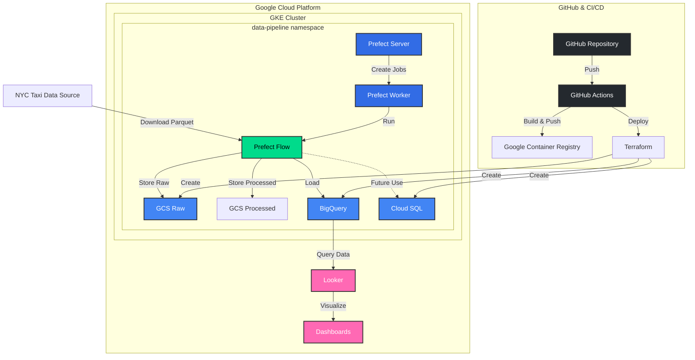

# Data Pipeline Project

## Project Overview
This project implements a data pipeline using Prefect for workflow orchestration, running on Google Kubernetes Engine (GKE). The infrastructure is managed with Terraform, and deployments are automated through GitHub Actions.

## Project Structure

```
.
├── .github/
│   └── workflows/
│       ├── docker-build-push.yaml    # CI/CD for Docker image
│       ├── infrastructure.yaml       # Infrastructure deployment
│       └── terraform.yaml            # Terraform automation
│
├── pipeline-project/
│   ├── config/                      # Configuration files
│   │   
│   │
│   ├── docs/                        # Project documentation
│   │   ├── PrefectSetup.md
│   │   ├── README.md
│   │   └── Terraform.md
│   │
│   ├── k8s/                         # Kubernetes configurations
│   │   └── base/   
│   │       ├── cloudsql-proxy.yaml
│   │       ├── cloudsql-secret.yaml
│   │       ├── config.yaml
│   │       ├── connection-test-pod.yaml
│   │       ├── kustomization.yaml
│   │       ├── namespace.yaml
│   │       ├── prefect-rbac.yaml
│   │       ├── prefect-server.yaml
│   │       ├── prefect-worker.yaml
│   │       └── taxi-data-processing-job.yaml
│   │
│   ├── src/
│   │   └── processing/              # Data processing code
│   │       ├── flows/
│   │       │   ├── deploy.py        # Prefect deployment script
│   │       │   └── taxi_data_flow.py # Main data flow
│   │       ├── Dockerfile
│   │       ├── requirements.txt
│   │       └── tests/
│   │           └── test_connections.py
│   │
│   └── terraform/                   # Infrastructure as Code
│       ├── .terraform/
│       ├── modules/
│       │   ├── bigquery/           # BigQuery setup
│       │   ├── cloudsql/          # Cloud SQL setup
│       │   └── storage/           # GCS setup
│       ├── environments/
│       └── main.tf
```
## Data Pipeline

### Components
1. **Prefect Server**
   - Orchestrates workflows
   - Provides UI for monitoring
   - Runs in the `data-pipeline` namespace

2. **Prefect Worker**
   - Executes workflow tasks
   - Handles job creation in Kubernetes
   - Runs in the `data-pipeline` namespace

3. **Data Flow**
   - Downloads taxi data
   - Processes data using Pandas
   - Uploads to GCS
   - Loads into BigQuery

### Architecture components
 1. **Terraform**
    - Provisions and maintains our GCP resources through code
    - Can be triggered via Github Actions manually
    - Pipeline also runs automatically when there are changes in terraform directory
  
 2. **Kubernetes - GKE**
    - Orchestrates our data pipeline components (Prefect server, worker)
    - Configurations are automatically validated through Github Actions
    - Resources are defined as code in base directory and applied via kubectl
    - Provides scalable and maintainable way to run our containerized applications
 3. **Github & Github Actions**
    - Pipeline for terraform infrastructure deployment
    - Pipeline for validating Kubernetes configurations
    - Pipeline for building and pushing Docker Image to Container Registry


### Kubernetes Infrastructure 

```mermaid
graph TD
    subgraph GKE-Cluster[GKE Cluster Info]
        subgraph Cluster-Details[Cluster Details]
            CN[Name: default-pool]
            CV[Version: 1.30.8-gke.1051000]
            CM[Machine: e2-medium]
            CN2[Nodes: 2]
            CAS[Autoscaling: 1-3 nodes per zone]
        end

        subgraph Namespace[data-pipeline namespace]
            %% Deployments and their components
            D1[Deployment: cloudsql-proxy] --> RS1[ReplicaSet: cloudsql-proxy]
            D2[Deployment: prefect-server] --> RS2[ReplicaSet: prefect-server]
            D3[Deployment: prefect-worker] --> RS3[ReplicaSet: prefect-worker]

            %% ReplicaSets to Pods
            RS1 --> P1[Pod: cloudsql-proxy]
            RS2 --> P2[Pod: prefect-server]
            RS3 --> P3[Pod: prefect-worker]

            %% Services
            S1[Service: cloudsql-proxy\nClusterIP: 34.118.234.121] --> P1
            S2[Service: prefect-server\nClusterIP: 34.118.230.23] --> P2

            %% Prefect Flow Jobs
            P3 --> J1[Job: abstract-badger-2d5xr]
            J1 --> FP1[Pod: abstract-badger-2d5xr-b4fg2\nStatus: Completed]

        end
    end

    %% Style definitions
    style GKE-Cluster fill:#f0f8ff,stroke:#333,stroke-width:2px
    style Cluster-Details fill:#e6f3ff,stroke:#666,stroke-width:1px
    style Namespace fill:#f5f5f5,stroke:#333,stroke-width:2px
    
    classDef clusterInfo fill:#E3F2FD,stroke:#1565C0,color:black
    classDef deployment fill:#2196F3,stroke:#1565C0,color:white
    classDef replicaset fill:#4CAF50,stroke:#2E7D32,color:white
    classDef pod fill:#FFC107,stroke:#FFA000
    classDef service fill:#9C27B0,stroke:#6A1B9A,color:white
    classDef job fill:#FF5722,stroke:#D84315,color:white
    classDef completedPod fill:#795548,stroke:#4E342E,color:white
    
    class CN,CV,CM,CN2,CIP,CAS,COS clusterInfo
    class D1,D2,D3 deployment
    class RS1,RS2,RS3 replicaset
    class P1,P2,P3 pod
    class S1,S2 service
    class J1 job
    class FP1,CT completedPod

### Continuous Integration/Deployment
The project uses GitHub Actions for:
1. Building and pushing Docker images
2. Deploying infrastructure changes
3. Running static checks of Kubernetes yaml files

Workflows are triggered on:
- Push to main branch
- Pull requests
- Manual triggers

### Environment Variables
Environment variables are managed through Kubernetes ConfigMaps and Secrets in the `data-pipeline` namespace.

## Security

### Service Accounts
- Kubernetes service account: `prefect-worker`
- GCP service account with roles:
  - Storage Admin
  - BigQuery Data Editor
  - Cloud SQL Client
  - GCR User

### Secrets Management
- GCP credentials stored as Kubernetes secrets
- Database credentials managed through secrets
- Secret mounting handled via Kubernetes volumes

## Tutorial

### Prerequisites
1. Google Cloud Account 
2. GitHub account with necessary permissions
3. Following tools installed locally for development:
   - Google Cloud SDK
   - kubectl
   - Git

### Step1: Kubernetes Setup

1. Install Google Cloud SDK
   1. Run the command `gcloud version` to verify Google Cloud SDK is installed
   2. Run `gcloud components install kubectl`
2. Run: `gcloud auth login`
3. Run: `gcloud container clusters get-credentials cloud-computing-cluster --zone us-central1-c --project teak-gamma-442315-f8`

You can now use kubernetes on our cluster from your local shell

#### Deploy Infrastructure
```bash
# Apply base configurations
kubectl apply -k k8s/base
```

### Step 2: Initial Setup
1. Fork and clone the repository:
   ```bash
   git clone https://github.com/ero67/Cloud-Computing-Project.git
   cd pipeline-project
   ```

2. Set up GitHub Secrets:
   - `GCP_SA_KEY`: Your Google Cloud service account key
   - `TF_VAR_db_password`: Database password for Terraform
   - `GITHUB_TOKEN`: For GitHub Actions

### Step 3: Infrastructure Deployment
The infrastructure is automatically deployed through GitHub Actions when changes are pushed to `main`. The workflow:
1. Validates Terraform configurations
2. Plans infrastructure changes
3. Applies changes automatically on `main` branch

To trigger manual deployment:
1. Go to GitHub Actions tab
2. Select "Terraform CI/CD"
3. Click "Run workflow"

### Step 4: Pipeline Deployment
The data pipeline code is automatically built and deployed when changes are pushed to the `src/processing` directory:
1. GitHub Actions builds Docker image
2. Pushes to Google Container Registry
3. Updates Kubernetes deployments

To monitor deployment:
1. Check GitHub Actions status
2. Verify image in GCR:
   ```bash
   gcloud container images list-tags gcr.io/teak-gamma-442315-f8/taxi-flow
   ```

### Step 5: Access and Initial Setup
1. Connect to the cluster:
   ```bash
   gcloud container clusters get-credentials cloud-computing-cluster --zone us-central1-c --project teak-gamma-442315-f8
   ```

2. Access Prefect UI:
   ```bash
   kubectl port-forward svc/prefect-server 4200:4200 -n data-pipeline
   ```
   Open http://localhost:4200 in your browser

### Step 5: Create and Configure Work Pool
1. In Prefect UI:
   - Go to "Work Pools" tab
   - Click "+" to create new work pool
   - Name: "k8s-pool"
   - Type: Select "Kubernetes"

2. Configure Work Pool:
   - Set Namespace: "data-pipeline"
   - Set Service Account Name: "prefect-worker"
   - Set Image: "gcr.io/teak-gamma-442315-f8/taxi-flow:latest"
   - Set Image Pull Policy: "Always"

Simpler step would be copying contents of *pipeline-project/config/workpool-backup* file into base config of workpool in advanced settings.


### Step 6: Run the Flow
1. Deploy the flow:
   ```bash
   kubectl apply -f k8s/base/taxi-data-processing-job.yaml
   ```

2. Monitor flow deployment:
   ```bash
   kubectl logs -f job/taxi-data-flow-job -n data-pipeline
   ```

3. Run the flow in Prefect UI:
   - Go to "Deployments"
   - Find "taxi-data-flow"
   - Click "Run"
   - Monitor execution in the "Flow runs" tab

4. Verify flow execution:
   - Check flow logs in Prefect UI
   - Verify data in GCS bucket
   - Check BigQuery for loaded data

### Step 7: Regular Operation
1. The flow will automatically run when:
   - Manual trigger in Prefect UI
   - Scheduled runs (if configured deployment is configured that way)

2. Monitor ongoing operations:
   - Flow runs in Prefect UI
   - Kubernetes pods status:
     ```bash
     kubectl get pods -n data-pipeline
     ```
   - Worker status:
     ```bash
     kubectl logs -f -l app=prefect-worker -n data-pipeline
     ```
### Step 8: Looker vizualization of processed data
    Now user can freely use data stored in BigQuery to visualize the data using Looker for example.

### Development Workflow
1. Create a new branch:
   ```bash
   git checkout -b feature/new-feature
   ```

2. Make changes:
   - Infrastructure changes in `terraform/`
   - Pipeline code in `src/processing/`
   - Kubernetes configs in `k8s/`

3. Push changes:
   ```bash
   git push origin feature/new-feature
   ```

4. Create Pull Request:
   - GitHub Actions will automatically:
     - Validate Kubernetes configurations
     - Run Terraform plan
     - Build and test Docker image

### Troubleshooting
1. Pipeline Issues:
   ```bash
   kubectl logs -n data-pipeline <pod-name>
   ```

2. Work Pool Issues:
   - Verify work pool configuration in UI
   - Check worker logs:
     ```bash
     kubectl logs -f -l app=prefect-worker -n data-pipeline
     ```
   - Verify service account and secrets

3. Flow Run Issues:
   - Check flow run logs in Prefect UI
   - Verify GCP credentials mounting
   - Check for permission issues in GCS/BigQuery

4. GitHub Actions Failures:
   - Check Actions tab for detailed logs
   - Verify secrets are properly set
   - Check repository permissions


## Research Summary
In this project we successfully implemented automated data pipeline in the cloud.

Since the idea of a project was clear from the start, all we had to do was to figure out how to implement all of the parts of the project and how to integrate them together while applying best Cloud Computing practises

### Kubernetes
We decided to host our essential component of our project Prefect in GKE (Google Kubernetes Engine).

This is the part where we applied first technology we learned in this course.

#### What needed to be researched ?
We needed to figure out how to run Prefect server and Prefect worker/agent in our Kubernetes Cluster.

We decided to run self-hosted Prefect server sicne it would avoid external dependency - Prefect Cloud.

After fair amount of research and debugging, we managed to  successfully configure both services Prefect worker and Prefect server to communicate with each other.


### Infrastructure as Code
The next challenge was setting up our infrastructure in a repeatable and maintainable way.
We chose Terraform for this task as it aligned well with the course material and industry best practices.

#### What needed to be researched?
We had to understand how to properly structure our Terraform code to manage different GCP resources. What modules to use ?
This led us to organize our code into modules for different services (BigQuery, Cloud SQL, Storage).

### CI/CD Pipeline
To maintain good development practices, we implemented automated deployment pipelines using GitHub Actions.

#### What needed to be researched?
We needed to figure out how to:
- Automatically build and push our Docker images
- Validate Kubernetes configurations
- Apply Terraform changes safely
- Handle secrets and credentials securely

Setting up pipeline for building and pushing Docker images was pretty straight forward since its a common type of CI/CD pipeline

For validating Kubernetes configurations we used kubeval and kubeconform.

We also created pipeline for applying Terraform changes and configuration. This is a great way to autoamte the process of creating all of the essential instances of services for our project.


### Prefect Flow deployment
We had to figure out how to deploy our flows to our prefect server and how to properly run the flow.

After research of how to use **Prefect** Kubernetes infrastructure we managed to implement the flow followingly:
1. Initial deploy of flow using Kubernetes yaml file
2. After deployment is done, user runs the flow for Prefect server UI running in our Kubernetes pod
3. Worker processes request for running the flow and creates temporary Kubernetes job which runs the flow
4. Flow is configured to always pull image from our GCR container registry and runs in the temporary pod created by the job.

## Summary of Lessons Learned

### Key Technical Learnings
1. **Kubernetes & Prefect Integration**
  - Self-hosted Prefect requires careful configuration of worker and server communication
  - Proper roles for service accounts and secret management is crucial for secure operation
  - Work pool configuration is essential for successful flow execution

2. **Infrastructure Management**
  - Terraform automation through GitHub Actions ensures consistent deployments
  - Breaking infrastructure into modules (storage, database, compute) improves maintainability

3. **CI/CD Pipeline**
  - Automated validation prevents misconfiguration
  - Regular testing of infrastructure changes reduces deployment issues
  - Keeping secrets secure while maintaining automation requires careful planning

### What Worked Well
- Using GKE for orchestration
- Implementing infrastructure as code
- Automating deployments with GitHub Actions
- Self-hosting Prefect for better control

## Possible future improvements
- Implement monitoring (via Grafana)
- CI/CD Pipeline for running kubernetes commands and deployments could be added
- More testing
- Automatic work-pool creation via kubernetes